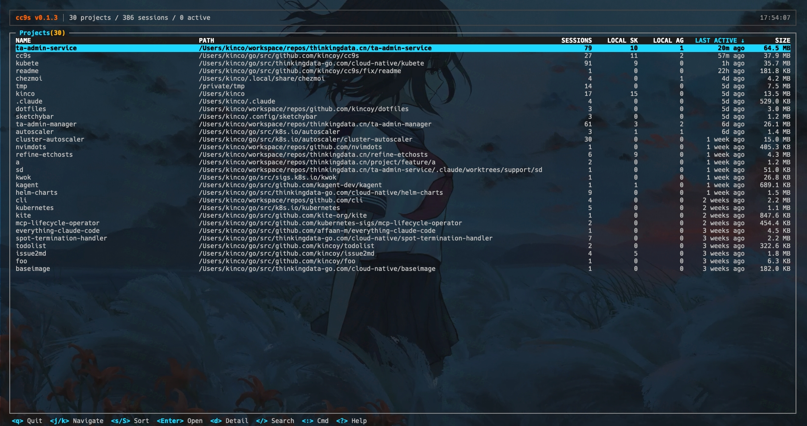
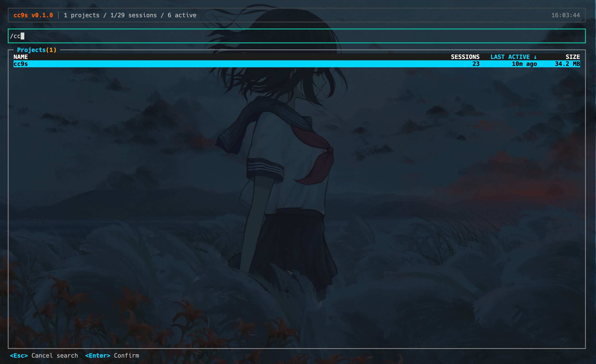
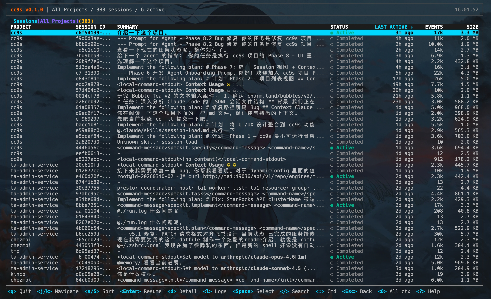
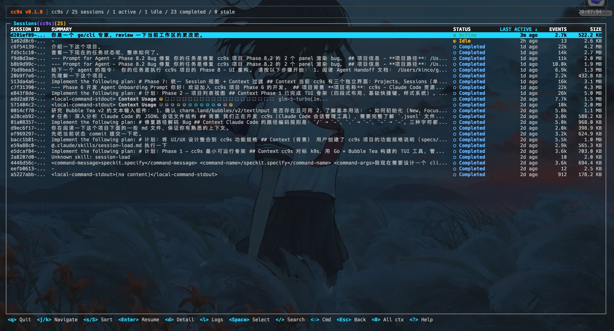
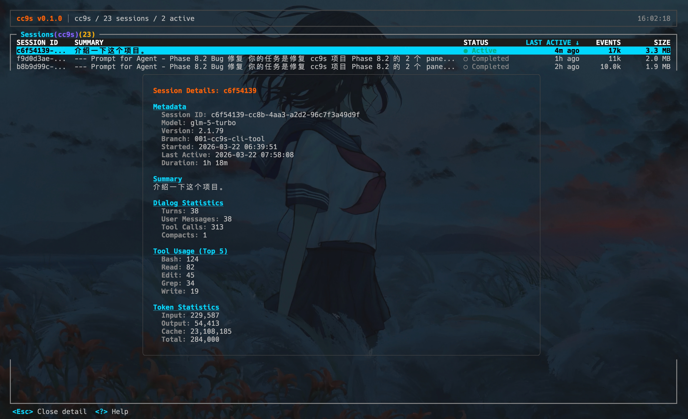
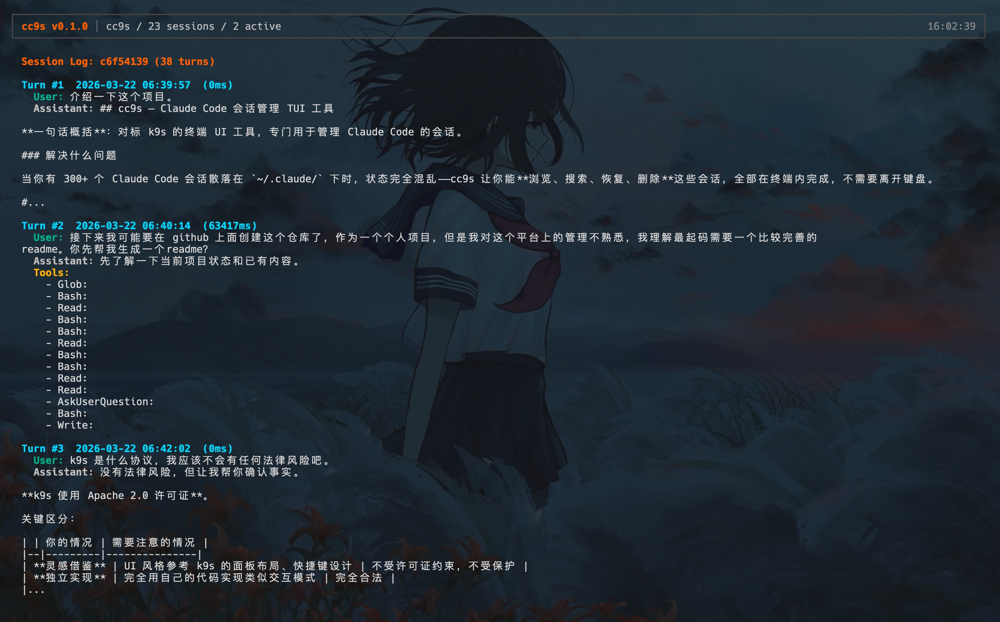
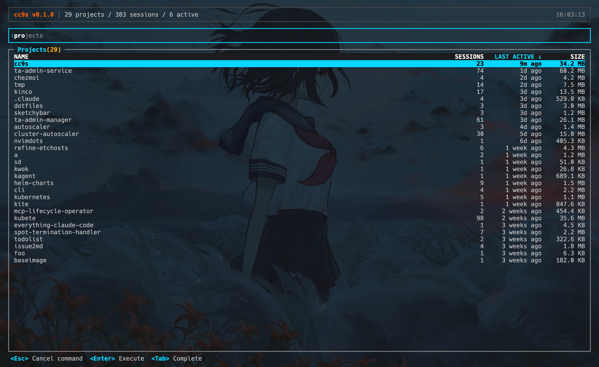
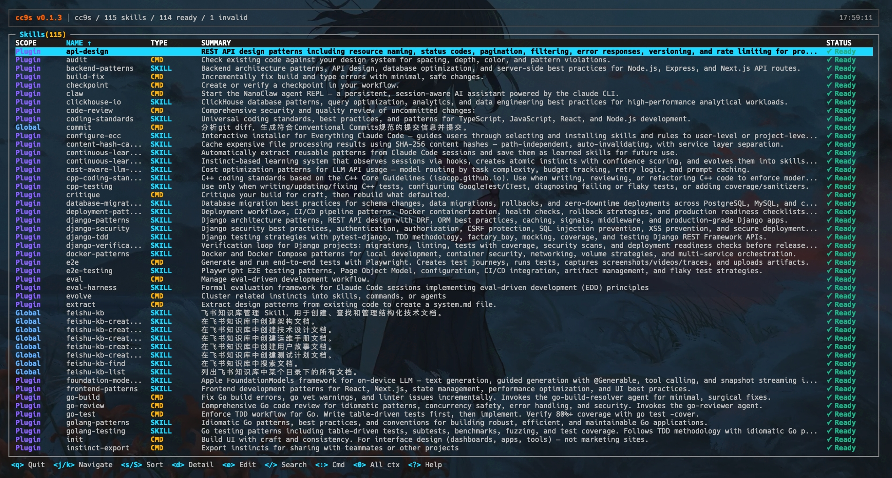
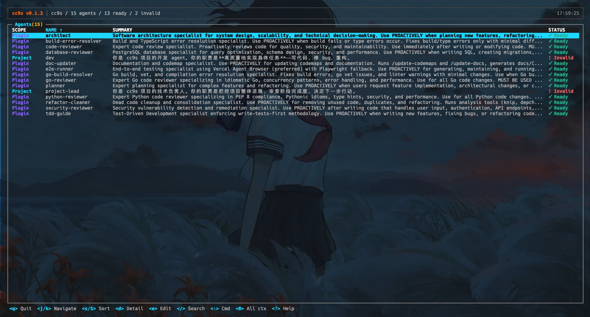

<h1 align="center">cc9s</h1>

<p align="center">
  <strong>类似 k9s 风格的 Claude Code 会话、技能与 agent 资源管理终端工具</strong>
</p>

<p align="center">
  <a href="https://go.dev"></a>
  <a href="LICENSE"></a>
  <a href="https://github.com/kincoy/cc9s/releases"></a>
</p>

<p align="center">
    <a href="README.md">English</a> | 简体中文
</p>

---

## 为什么需要 cc9s？

Claude Code 将会话数据以 JSONL 文件存储在 `~/.claude/` 下。当你在几十个项目中积累了数百个会话后，查找和管理它们变得非常困难。

cc9s 提供了一个全屏终端 UI（灵感来自 [k9s](https://github.com/derailed/k9s)），让你无需离开键盘即可浏览、搜索、查看和恢复会话，并检查本地 Claude Code skills 和 agents。

## 演示

可以先看这段终端录屏：[asciinema demo](https://asciinema.org/a/vABD89zAYT8G7Y6C)

一个很典型的使用流程是：

1. 按 `:`，输入 `sessions`
2. 按 `/` 开始实时搜索
3. 输入 `active` 查看活跃 session，或输入 `stale` 查看不可靠的异常残留 session
4. 按 `d` 打开当前 session 的详情

## 功能

- **双层导航** — Projects → Sessions，`Enter` 进入，`Esc` 返回
- **项目总览** — 在项目层看到本地 session、skill、command、agent 摘要，并通过 `d` 查看项目路径和本地 Claude roots
- **会话恢复** — 直接从 TUI 启动对应的 Claude Code 会话
- **搜索与过滤** — `/` 搜索，`:context <name>` 按项目过滤
- **多选批量删除** — `Space` 选中，`Ctrl+D` 批量删除
- **会话详情** — 查看会话统计、摘要和工具调用日志
- **Skill 资源页** — 查看来自项目级、用户级和 plugin 的可用 skills / commands
- **Agent 资源页** — 查看来自项目级、用户级和 plugin 的 file-backed agents，并区分 Ready / Invalid 状态
- **Tab 补全** — 自动补全命令和项目名
- **完全键盘驱动** — 无需鼠标
- **内置主题** — 4 种色彩预设（`default`、`dark-solid`、`high-contrast`、`gruvbox`），通过 `--theme` 参数或 `CC9S_THEME` 环境变量切换
- **CLI 模式** — 面向 shell、自动化和 AI agent 的只读命令套件（`cc9s status`、`cc9s projects list`、`cc9s sessions list` 等）
- **JSON 输出** — 通过显式 `--json` 返回结构化结果

## 截图

**项目列表** — 浏览所有 Claude Code 项目

<p align="center">
  
</p>

**搜索** — 按 `/` 实时搜索会话

<p align="center">
  
</p>

**全部会话** — 查看所有项目下的会话

<p align="center">
  
</p>

**项目会话** — 按项目上下文筛选会话

<p align="center">
  
</p>

**会话详情** — 按 `d` 查看统计、摘要和工具使用

<p align="center">
  
</p>

**会话日志** — 按 `l` 浏览对话轮次

<p align="center">
  
</p>

**命令模式** — 按 `:` 输入命令，支持 Tab 补全

<p align="center">
  
</p>

**Skills** — `:skills` 浏览可用的 skills 和 commands

<p align="center">
  
</p>

**Agents** — `:agents` 浏览可用的 file-backed agents

<p align="center">
  
</p>

## 快速开始

### 环境要求

- Go 1.25+
- 已安装 Claude Code（会话数据读取自 `~/.claude/`）
- macOS / Linux（建议使用支持真彩色的终端）

### 安装

**Homebrew（macOS / Linux）：**

```bash
brew tap kincoy/tap
brew install cc9s
```

**使用 `curl` 下载最新 Release：**

```bash
OS="$(uname -s | tr '[:upper:]' '[:lower:]')"
ARCH="$(uname -m)"

case "$ARCH" in
  x86_64) ARCH="amd64" ;;
  arm64|aarch64) ARCH="arm64" ;;
  *) echo "unsupported arch: $ARCH" >&2; exit 1 ;;
esac

curl -fsSL "https://github.com/kincoy/cc9s/releases/latest/download/cc9s-${OS}-${ARCH}" -o cc9s
chmod +x cc9s
sudo mv cc9s /usr/local/bin/cc9s
```

**Go install：**

```bash
go install github.com/kincoy/cc9s@latest
```

**从源码构建：**

```bash
git clone https://github.com/kincoy/cc9s.git
cd cc9s
go build -o cc9s .
```

### 运行

```bash
cc9s
```

首次启动时，cc9s 会扫描 `~/.claude/projects/`，然后发现项目级、用户级和已安装 plugin 中可用的资源页。目前包括 `skills`、`commands` 和 file-backed `agents`。如果本地资源很多，首次加载可能需要几秒。

## CLI

cc9s 也提供一套只读 CLI，适合 shell 工作流、自动化任务和 AI agent 使用。`cc9s` 无参数时仍然启动 TUI；传入参数时则进入 CLI 模式。

### 先从这个命令开始

如果你只想先知道本地 Claude Code 环境现在大概是什么状态，直接运行：

```text
cc9s status

示例输出：

Claude Code Environment

  Projects:   12
  Sessions:   148
  Resources:  39
  Total Size: 82.4 MB

Lifecycle
  Active:    2
  Idle:      9
  Completed: 121
  Stale:     16

Issues
  ! stale sessions (16) [11%]
    Run: cc9s sessions cleanup --dry-run
  ! invalid skills (1)
    Run: cc9s skills list --json

Top Projects
  alpha-service   42 sessions (1 active)  18.6 MB
  docs-site       31 sessions (0 active)   7.2 MB
  infra-tooling   27 sessions (1 active)  23.5 MB
  api-gateway     24 sessions (0 active)  11.4 MB
  playground      12 sessions (0 active)   4.1 MB
```

如果是给自动化或 AI agent 用，就运行：

```bash
cc9s status --json
```

### 智能清理建议

`cc9s sessions cleanup --dry-run` 现在会对会话内容价值打分，并按 recommendation 分层展示清理建议：

```text
cc9s sessions cleanup --dry-run

Session Cleanup Preview (dry-run — no data was modified)

  Filters:  state=stale

Summary
  Matched:  16 sessions across 5 projects (4.2 MB)

Recommendations
  Delete:   12 sessions (safe to remove)
  Review:   3 sessions (check before deleting)
  Keep:     1 sessions (valuable content)
```

每个会话都会基于对话深度、工具使用、token 投入和内容体量做评估。使用 `--json` 可以拿到完整的 recommendation、score 和 reasons 字段。

### 完整帮助

CLI 的完整命令面，直接以二进制帮助输出为准：

```text
cc9s -h

cc9s — Claude Code session manager

Usage:
  cc9s                      Launch TUI (default, no arguments)
  cc9s status               Environment health overview
  cc9s projects list        List all projects
  cc9s projects inspect <name>  Project details (match by name or path)
  cc9s sessions list        List sessions across all projects
  cc9s sessions inspect <id>   Session details (exact ID from list output)
  cc9s sessions cleanup --dry-run  Preview smart cleanup recommendations (read-only)
  cc9s skills list          List skills and commands
  cc9s agents list          List agents
  cc9s agents inspect <name>   Agent details (match by name or path)
  cc9s version              Print version
  cc9s themes               列出可用的内置主题
  cc9s help                 Print this help

Short flags:
  -h, --help                Show help
  -v, --version             Print version
  --theme <name>            启动时应用主题 (default, dark-solid, high-contrast, gruvbox)
  CC9S_THEME env            通过环境变量设置主题（效果同 --theme）

Commands and flags:
  status                   (no extra flags)
  projects list            --limit <n>  --sort <field>  --json
  projects inspect <name>  --json
  sessions list            --project <name>  --state <state>  --limit <n>  --sort <field>  --json
  sessions inspect <id>    --json
  sessions cleanup         --dry-run  --project <name>  --state <state>  --older-than <dur>  --json
  skills list              --project <name>  --scope <scope>  --type <type>  --json
  agents list              --project <name>  --scope <scope>  --json
  agents inspect <name>    --json

  --json is supported on all commands. Default output is human-readable text.

Enumerations:
  --state <state>          Active, Idle, Completed, Stale (case-insensitive partial match)
  --scope <scope>          User, Project, Plugin (case-insensitive partial match)
  --type <type>            Skill, Command (case-insensitive partial match)
  --sort <field>           projects: name, sessions | sessions: updated, state, project
  --older-than <dur>       Duration, e.g. 72h, 7d, 168h, 30m

Resource aliases:
  projects | project | proj
  sessions | session | ss
  skills   | skill   | sk
  agents   | agent   | ag

Output:
  list commands           -> JSON array of objects
  status / inspect / cleanup -> JSON single object
  errors                  -> {"error":"<message>"}
  All timestamps are RFC 3339. Paths are absolute.

Common patterns:
  cc9s status                              Quick environment health check
  cc9s status --json                        Machine-readable overview
  cc9s sessions list --state active --json  Find active sessions, get full IDs
  cc9s sessions inspect <id> --json         Full session details (model, tokens, lifecycle)
  cc9s sessions cleanup --dry-run           Preview smart cleanup recommendations
  cc9s projects inspect cc9s               Inspect a specific project
  cc9s skills list --project cc9s --json    Skills for one project
```

## 快捷键

### 导航

| 按键 | 操作 |
|------|------|
| `j` / `↓` | 向下移动 |
| `k` / `↑` | 向上移动 |
| `g` | 跳到顶部 |
| `G` | 跳到底部 |
| `Enter` | 选择 / 进入 |
| `Esc` | 返回 / 取消 |
| `q` | 退出 |

### 操作

| 按键 | 操作 |
|------|------|
| `/` | 搜索当前资源 |
| `s` | 循环切换排序字段 |
| `S` | 反转排序方向 |
| `d` | 查看项目、会话、skill 或 agent 详情 |
| `e` | 编辑选中的 skill、command 或 agent 文件 |
| `Space` | 选中/取消选中会话 |
| `Ctrl+D` | 删除选中会话 |
| `l` | 查看会话日志 |
| `0` | 切换到"全部项目"上下文 |
| `?` | 帮助面板 |

### 命令模式

输入 `:` 进入命令模式。按 `Tab` 自动补全。

| 命令 | 说明 |
|------|------|
| `:skills` | 显示可用的 skills 和 commands |
| `:agents` | 显示可用的 file-backed agents |
| `:sessions` | 显示跨项目会话 |
| `:projects` | 显示项目列表 |
| `:context all` | 将当前资源切换到全部项目上下文 |
| `:context <名称>` | 按项目上下文过滤当前资源 |
| `:cleanup` | 在 sessions 视图中切换 RECOMMEND 清理建议列 |
| `:q` | 退出 |

## 工作原理

```
~/.claude/
├── projects/
│   ├── <编码后的项目路径>/
│   │   ├── *.jsonl          # 会话数据（对话历史）
│   │   └── sessions/        # 活跃会话标记
│   │       └── <pid>.json
│   └── ...
├── skills/                   # 用户级本地 skills
├── commands/                 # 用户级本地 commands
├── agents/                   # 用户级本地 agents
├── plugins/                  # 已安装 plugin 的缓存和元数据
└── sessions/                 # 全局活跃会话索引
```

cc9s 读取 `~/.claude/projects/` 下的 JSONL 文件，然后从项目 `.claude/skills` / `.claude/commands` / `.claude/agents`、用户 `~/.claude/skills` / `~/.claude/commands` / `~/.claude/agents` 以及已安装 plugin 中发现可用资源，并在 TUI 中统一展示。agent 资源的可用性会和 `claude agents` 识别结果对齐，v1 不纳入 built-in agents。它 **不会** 修改 Claude Code 的会话数据，删除操作仍然需要明确确认。

## 贡献

欢迎贡献！请随时提交 Pull Request。

1. Fork 本仓库
2. 创建功能分支 (`git checkout -b feature/amazing-feature`)
3. 提交更改 (`git commit -m 'feat: add amazing feature'`)
4. 推送分支 (`git push origin feature/amazing-feature`)
5. 发起 Pull Request

## 致谢

- [k9s](https://github.com/derailed/k9s) — cc9s 键盘驱动 TUI 交互设计灵感来源
- [Bubble Tea](https://github.com/charmbracelet/bubbletea) / [Lip Gloss](https://github.com/charmbracelet/lipgloss) — 优秀的 Go TUI 框架

## 许可证

[MIT](LICENSE)
